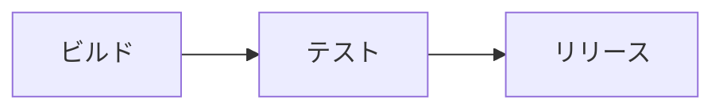
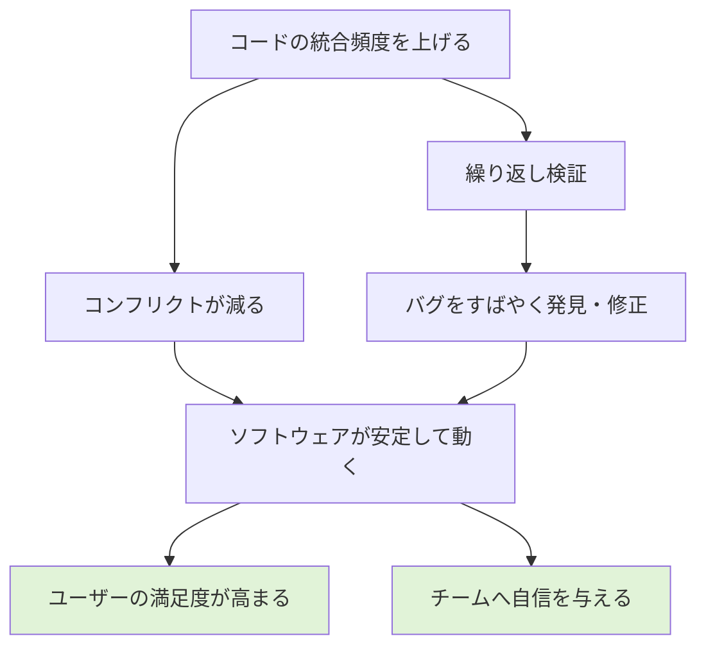
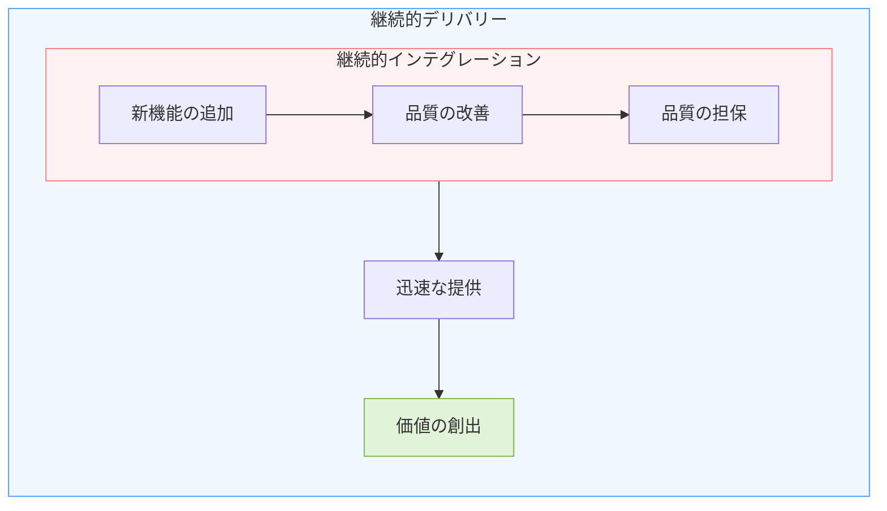

# LEARNING NOTES

# About -概要

- 各章の学習メモ
- 理解のポイント
- 実践的な気づき
- 疑問点
- 実装した具体的なワークフロー
- 学んだベストプラクティス

# Index -目次

<!-- TOC -->

- [LEARNING NOTES](#learning-notes)
- [About -概要](#about--概要)
- [Index -目次](#index--目次)
- [Contents -内容](#contents--内容)
  - [1.1 ソフトウェア開発](#11-ソフトウェア開発)
    - [1.2 CI/CD](#12-cicd)
      - [1.2.1 継続的インテグレーション](#121-継続的インテグレーション)
      - [1.2.2 継続的デリバリー](#122-継続的デリバリー)

<!-- /TOC -->

# Contents -内容

## 1.1 ソフトウェア開発

### 1.2 CI/CD

- CI (Continuous Integration)とCDの(Continuous Deployment/Delivery)の概要を理解
- ソフトウェア開発のライフサイクル



- CI/CDは、ビルドからリリースまでのソフトウェア開発プロセスを自動化する



- 自動化によって、変更のための試行錯誤のスピードが上がり、より迅速に価値を生み出せる
- CI/CDはスピード面でのメリットだけでなく、プロセスの継続性や品質管理にも貢献する
- 具体的にはどのようなワークフローを設計すれば良いか、実装の際の留意点などを把握する必要がある

#### 1.2.1 継続的インテグレーション

- CIは継続的インテグレーション（Continuous Integration）の略称
- インテグレーションとは変更したコードをコードベースへ取り込み、検証する営み
- 単にコードベースへ統合するだけではなく、「検証」する点が重要
- コードの変更を頻繁にコードベースへ統合し、正しく動作するか繰り返し検証する、これを本書ではCIと呼ぶ
  - コードの統合頻度を上げる
  - コンフリクトが減る
  - 繰り返し検証
  - バグを発見->すばやく修正できる
  - ソフトウェアが安定して動く
  - ユーザーの満足度が高まる
  - CI（絶え間ない検証）は、チームへ自信を与える
  


#### 1.2.2 継続的デリバリー

- CDは継続的デリバリー（Continuous Delivery）の略称
- コードだけでは、まだユーザーはソフトウェアとして使えない
- どうにかしてユーザーへ送り届ける、この活動をリリース（Release）と呼ぶ
- リリースはヒューマンエラーが発生しやすい
- ソフトウェアによって異なる作業、手順も複雑化しやすいのに何度も実行する
- いつでも安全にリリースできる状態を保ち、ソフトウェアを繰り返し改善する、これを本書ではCDと呼ぶ
- 「自動化」すれば繰り返しに強くなる
- 人間が介在する余地を小さくすれば、いつでも安全にユーザーへソフトウェアを届けられる

```yaml
ソフトウェア開発では新機能の追加だけでなく、品質の改善も大切です。そして品質を担保するのがCIです。
CIとCDは同列の概念に見えますが、CIはCDに包含されます。
そうして高品質なソフトウェアを迅速に提供することも、CDの重要な役割です。
```


