# LEARNING NOTES

## About -概要

- 各章の学習メモ
- 理解のポイント
- 実践的な気づき
- 疑問点
- 実装した具体的なワークフロー
- 学んだベストプラクティス

## Index -目次

<!-- TOC -->

- [LEARNING NOTES](#learning-notes)
  - [About -概要](#about--概要)
  - [Index -目次](#index--目次)
  - [Contents -内容](#contents--内容)
    - [1.1 ソフトウェア開発](#11-ソフトウェア開発)
      - [1.1.1 複雑性と変化](#111-複雑性と変化)
      - [1.1.2 品質と期待値](#112-品質と期待値)
      - [1.1.3 不可避な試行錯誤](#113-不可避な試行錯誤)
    - [1.2 CI/CD](#12-cicd)
      - [1.2.1 継続的インテグレーション](#121-継続的インテグレーション)
      - [1.2.2 継続的デリバリー](#122-継続的デリバリー)
      - [1.2.3 ソフトウェア開発の持続可能性](#123-ソフトウェア開発の持続可能性)

<!-- /TOC -->

## Contents -内容

### 1.1 ソフトウェア開発

- **ソフトウェアエンジニアの仕事である「価値を届ける」為に必須なことは**
- **１）コードをソフトウェアへ変換し、正しく動作するか検証する**
- **２）ソフトウェアをユーザーが使える状態にする**

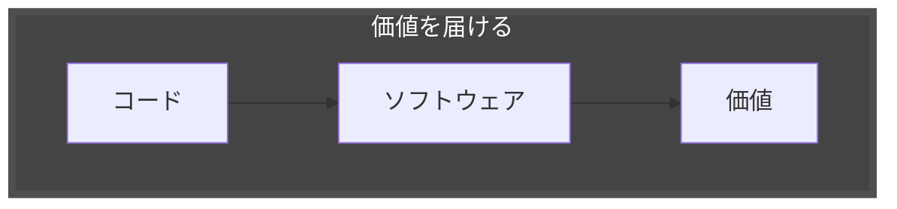

#### 1.1.1 複雑性と変化

- **ソフトウェアは多数の要素がある**
- **それらが互いに影響を及ぼし、時には予期せぬ振る舞いをする**
- **そしてニーズの多様化により市場環境や要件も日々変化する**

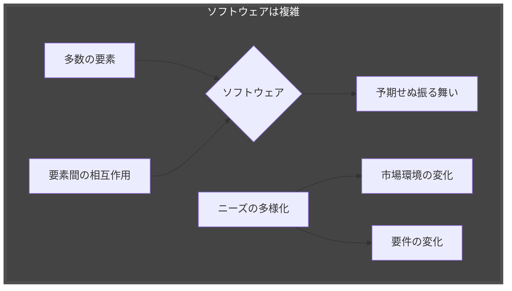

#### 1.1.2 品質と期待値

- **ソフトウェアは正しく動くことはもちろん**
- **軽快、使いやすい、情報漏えいにも気をつける**
- **ユーザーの期待値は上がり続け応えられなければあっさり見捨てられる**

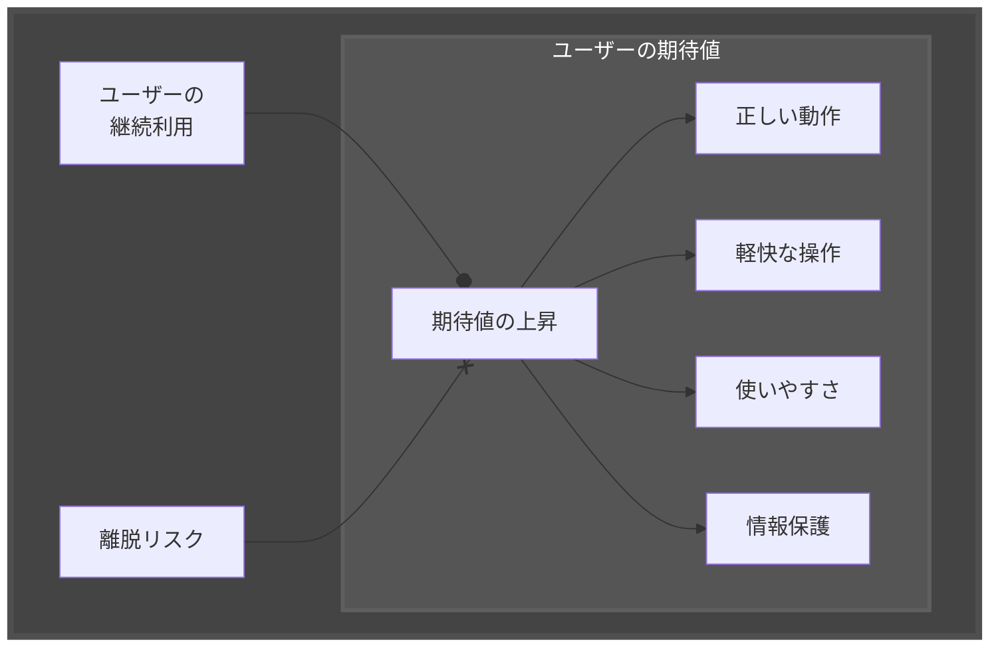

#### 1.1.3 不可避な試行錯誤

- **複雑で変化が早く品質も求められる**
- **事前計画は不可能、試行錯誤を繰り返し一歩一歩近づくしかない**
- **何度も繰り返す為には、ソフトウェア開発は継続的（Continuous）にならざるを得ない**

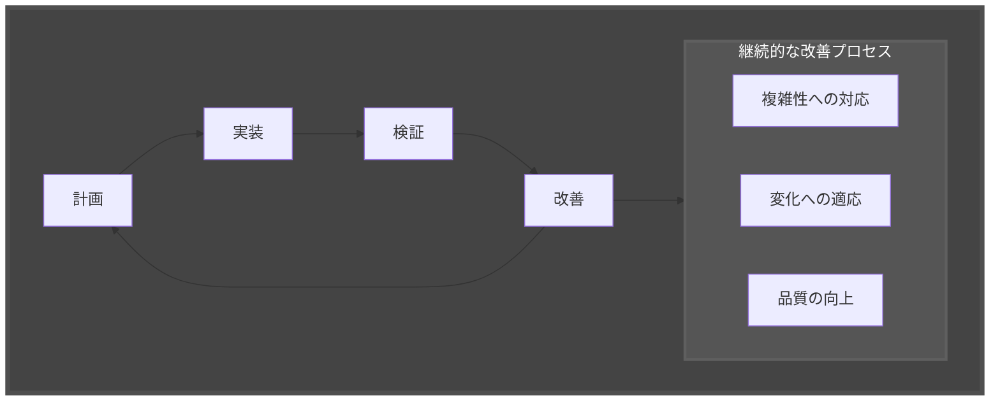

### 1.2 CI/CD

- **ソフトウェア開発のライフサイクルを繰り返しながらユーザーへ価値を届ける**
- **自動化によって、変更のための試行錯誤のスピードが上がり、より迅速に価値を生み出せる**
- **CI/CDはスピード面でのメリットだけでなく、プロセスの継続性や品質管理にも貢献する**

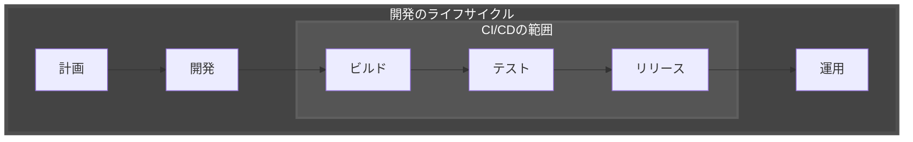

#### 1.2.1 継続的インテグレーション

- **CIは継続的インテグレーション（Continuous Integration）の略称**
- **インテグレーションとは変更したコードをコードベースへ取り込み、検証する営み**
- **単にコードベースへ統合するだけではなく、「検証」する点が重要**
  
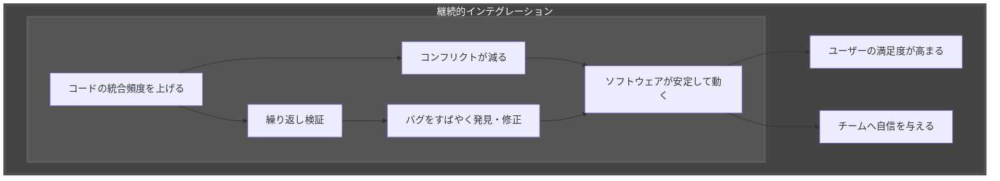

#### 1.2.2 継続的デリバリー

- **コードをどうにかしてユーザーへ送り届ける、この活動をリリース（Release）と呼ぶ**
- **リリースはヒューマンエラーが発生しやすい**
- **ソフトウェアによって異なる作業、手順も複雑化しやすいのに何度も実行する**

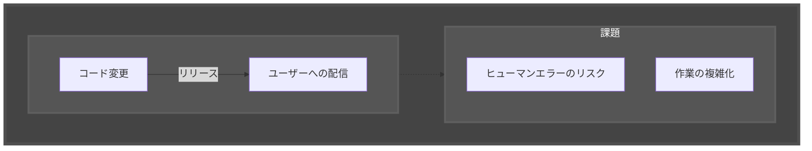

- **いつでも安全にリリースできる状態を保ち、ソフトウェアを繰り返し改善する（＝CD）**
- **CDは継続的デリバリー（Continuous Delivery）の略称**
- **「自動化」により人間が介在する余地を小さくすれば、繰り返しに強く、いつでも安全にユーザーへソフトウェアを届けられる**

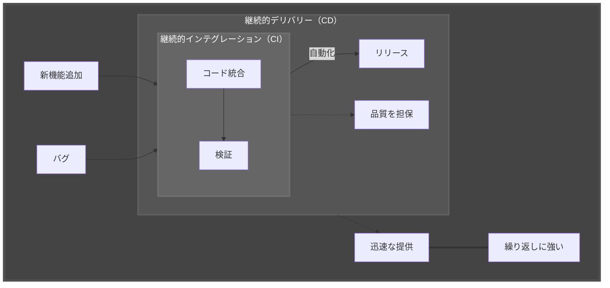

#### 1.2.3 ソフトウェア開発の持続可能性

- **ユーザーの満足度向上とビジネスの競争力向上だけでなく**
- **ソフトウェアエンジニアのクリエイティビティの向上もできる**
- **ソフトウェア開発の持続可能性を高め、長期に渡る価値提供を実現する**

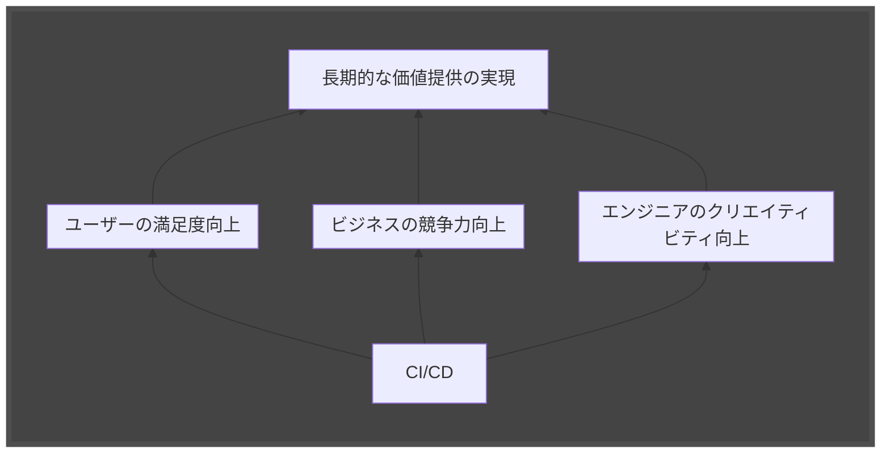

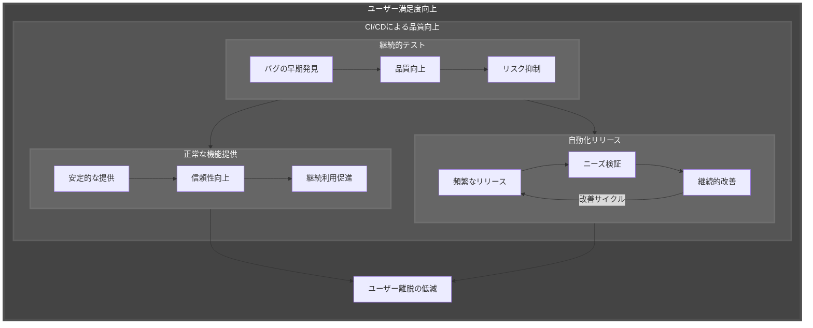

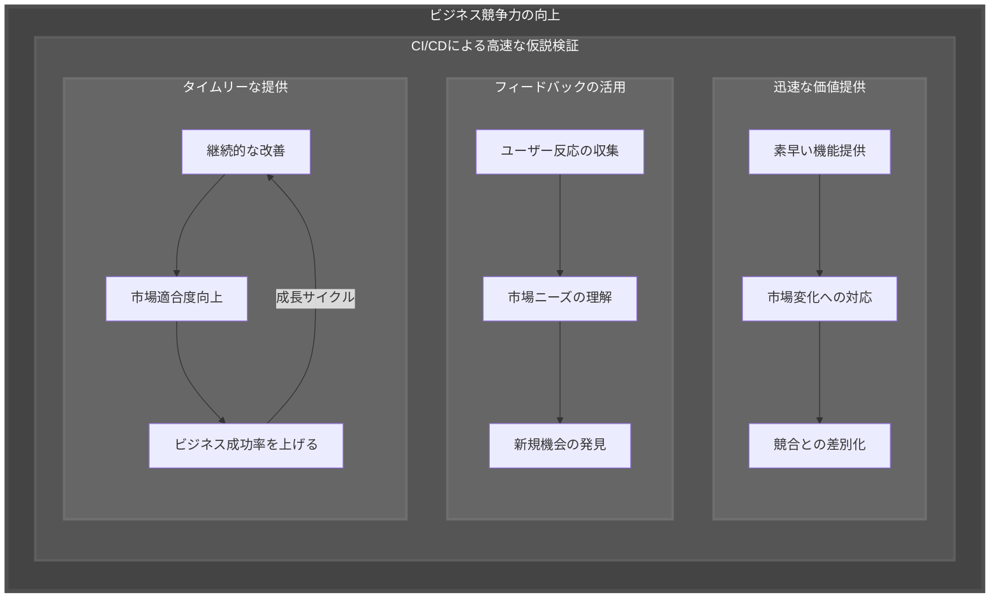

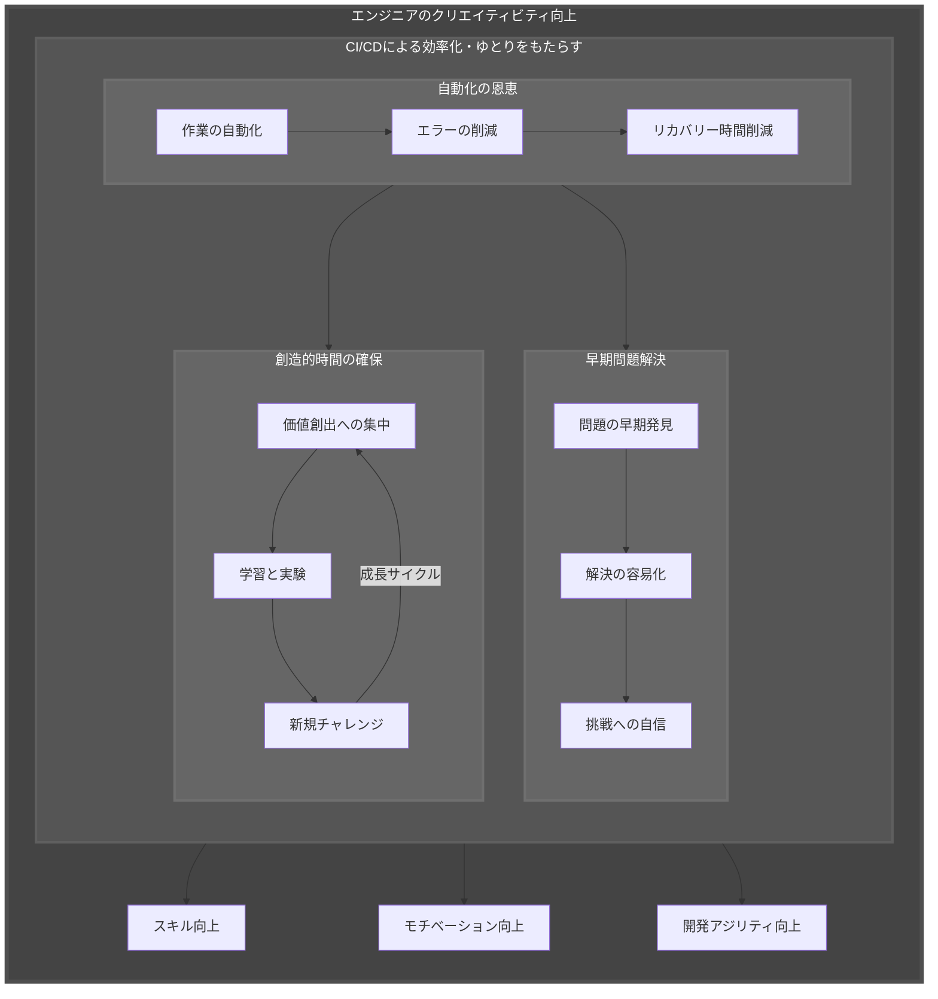
